# AI 数据分析 Agent 自主交付评测报告

NYC311 数据分析任务　两轮自主交付评测

## 摘要

项目1完成了一次纽约市311非紧急市政服务请求（NYC311）数据分析。本项目沿用这批数据，把选题、计算、制表和说明交给能够调用工具执行任务的AI系统，文中称为AI Agent。检查从提交的文件开始，逐步核对数字和解释，再按说明重做结果，观察最多两轮机会内能交付到什么程度。

本报告用“自主交付总分”概括检查结果，表中简记为S，满分100。八个系统中，六个两轮都有可评分成果，平均总分由71.67升至81.13，增加9.46分。GPT第二轮得98.5分，达到第1.2节列出的参照要求；Claude接管前工作得72分，Kimi两轮未形成可评分成品。

进一步核查结论时，Qwen的描述结构和时间窗口、Gemini的地址统计和文本解释都出现了会影响主要结论的错误。Grok、DeepSeek和GLM留下了一些可用的调查结果，但说明、终稿数字或专题定义还有缺口。各项得分及这些问题的来由在后文逐一展开。

费用也纳入比较。“目录价”按公布的模型单价和记录用量估算；“订阅额度计价”指平台按用量折算的额度消耗。GPT第二轮目录价约38.96元；GLM更快、价格较低，但热点定义要修。Claude由Grok接续后，订阅额度计价合计约165.69元。它们均不能直接视为额外支付的现金，详见第13节。

### 研究问题

1. 有限两轮中，哪些系统独立完成可用交付？

2. 六个评分维度的差异，对应哪些具体分析与错误？

3. 人能否依据提交材料复现主要结果、更新数据并定位错误？

4. 第二轮实际改善了什么，哪些问题仍然存在？

5. 合并质量、时间、费用和人工接管后，本次如何选择？

## 1 评测设计

### 1.1 任务与样本

本次输入是25个Parquet格式的数据文件，共7,525,498条NYC311请求记录、44个字段，也就是44列信息。一条记录表示一次服务请求，同一事件可能产生多次请求。八个系统使用同一批数据，自主选择问题，提交Excel和分析说明。评测检查这些文件能否供人阅读、核对和继续维护。

各系统最多运行两轮。第一轮使用基础任务提示，第二轮增加方法提示，Grok和Gemini另有检查清单。两轮分别保留提交文件和运行记录，再比较完成的工作。每种条件只运行一次，提示、系统自身调整和运行环境都有可能影响结果。

运行结束后，GPT、Grok、DeepSeek、GLM、Qwen和Gemini两轮都有可评分工作，后文用这六个系统比较两轮变化。Claude第一轮后段由Grok接续，第二轮未运行，单独说明；Kimi第一轮退出、第二轮失败，保留过程和已有费用记录，分数留空。

### 1.2 评分与核验

收到文件后，先核对问题、取数范围、计算和结论，再尝试按说明重做结果。“复现”指用保留的输入重做主要结果；“维护”还包括更新数据、找到出错位置并修改相关图表和文字。检查允许配置路径、安装所需软件及分步执行，由AI辅助审读和操作，未观察真人实际操作。

总分S由25个细项相加，满分100，分为六组，A—F是组别编号。A数据基础与问题定义15分，看是否理解数据、选题能否回答；B证据与计算正确性20分，看数字、比较和解释是否成立；C调查深度与判断20分，看是否继续追查差异、检查其他解释；D人工复现与维护25分，看能否读懂、重做和更新；E成品实际可用性10分，看文件是否清楚、便于使用；F自主性与资源纪律10分，看是否需要催促、接管和返工，以及如何处理失败、使用资源。

每项按完成程度给满分的100%、75%、50%、25%或0：依次为完整满足、主要满足但有局部缺口、部分关键要求完成、仅有有限可用成果、已查明未完成或关键内容不可用。例如，满分4分的一项，主要满足得3分。得分相加后不再另设上限；缺少评分材料时保留空白，0分表示已有材料支持该项为0。

与项目1比较时，本项目约定总分至少90分，人工维护至少22/25分，成品至少8/10分，自主性至少8/10分；D5“原AI的成品检查”须得满分3分，即原运行已检查最终文件的数字、显示和必要交互，发现问题后重查。核心结论还须没有已确认而未处理的错误。这些是本项目的评审条件；评测方后来补做的工作不计入原成果。

## 1.3 模型与运行条件

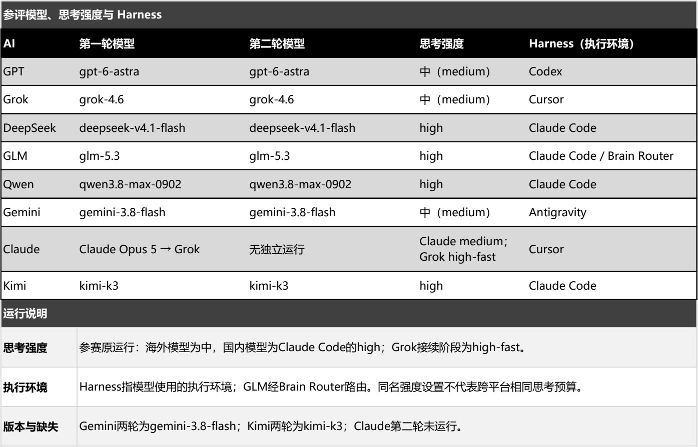

*表1  模型、思考强度与Harness。来源：Excel“字段说明”H2:L10。*

数据整理、评审计算和报告编制使用了AI辅助。为便于回查，下文分别说明系统原来提交了什么，以及评测时又核对或重做了什么。

表中的Harness是模型使用工具、读写文件和执行任务的软件环境，如Codex、Cursor、Claude Code。模型名称说明由谁生成回答，Harness说明通过什么环境完成任务。medium、high、high-fast是各环境的思考强度设置，同名档位不保证实际投入相同。Gemini两轮模型已核实为gemini-3.8-flash，Kimi两轮均为kimi-k3。

Claude第一轮在Grok接续前已留下调查和交付文件。评分据此得到72分；Grok后来订正的数字及重建结果另行记录，具体过程见第8节。

Kimi两轮都没有留下必交成品，无法按25项核出完整分数。第9节说明退出和重复读取的过程；第二轮已发生的约2.65分钟和1.48元也保留在比较中。

## 2 GPT

### 第一轮的工作

GPT先核对25个数据文件、文件哈希（用于识别文件内容是否变化的校验值）、主键（每条记录的唯一编号）和日期，发现文件名截止日期晚于最后一条记录。它用两年各1—8月作比较，按类别和行政区拆解287,342条净增量（后期总量减前期总量），重点分析街道、雪冰、供暖及布鲁克林和皇后区。第一轮主要说明增长来自哪里，对异常日期和地址追查较少。关闭时长指创建至关闭的记录时间差，其业务含义及类别改名的影响尚未确定，未据此判断效率或需求变化。

### 第二轮的工作

第二轮继续查雪冰增长：最高5天有32,819条请求，占同期55,230条的59.42%。GPT排除这5天，又单独排除雪冰中的Snow Tracking子类，检查增长是否集中在这些记录。渠道比较则使用固定的月份、类别和机构权重，减少构成变化的影响；ONLINE（在线渠道）份额仍由42.5592%升至49.3007%，相差6.7415个百分点，即两个百分比直接相减。交付遇到Excel兼容问题后，它调整生成方式，重新检查公式、图表来源和页面。

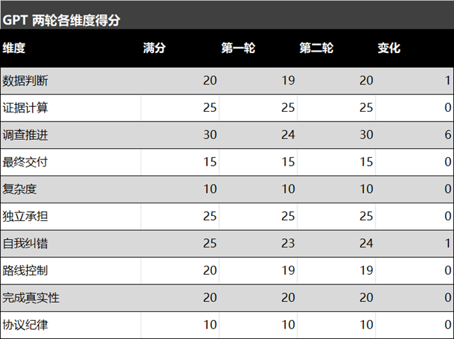

*表2  GPT两轮现行 S 六维得分*

## 2.1 GPT评分依据

数据基础与问题定义（/15） 14→15。核对44个字段、记录粒度与同月窗口，第二轮将问题收至峰日和渠道构成。

证据与计算正确性（/20） 20→20。峰日排除、类别排除和固定构成的渠道结果均可回查，两轮得满分。

调查深度与判断（/20） 14.25→20。第一轮主要是增量贡献概览；第二轮补做排除检验与替代解释，达到20分。

人工复现与维护（/25）19.75→23.5。留下SQL查询语句、CSV格式的数据表及六步运行顺序；摘要中的静态数字不会随数据自动更新，维护时仍须逐处核对。

成品实际可用性（/10） 10→10。两轮Excel和说明齐全，第二轮有打开、公式及图表检查记录。

### 自主性与资源纪律

自主性与资源纪律两轮均为10/10，运行中独立完成了任务。第一轮还缺少进一步调查和维护说明；第二轮已补查主要结果与文件显示。更新数据时仍要逐处核对静态摘要，因此更新与错误定位D4为4.5/6。

第二轮补查了峰日和渠道构成，主要文件与结果也经过检查。如果这次任务优先考虑完整交付和较少返工，可优先选用。两轮目录价约63.91元，高于Grok、DeepSeek、GLM、Qwen、Gemini的费用参考值，低于Claude含接续的165.69元。GPT的25项评分与原件位置见Excel“评分与用量”的S分项。

## 3 Grok

### 第一轮的工作

Grok选取两个各11个月的完整比较期，将346,695条净增量拆到供暖、雪冰、违停、道路、堵塞车道及其余类别，各项相加与全市增量一致。随后追查雪冰峰日、Street Condition（道路状况）的细分类别和机构关闭时长。它说明了残缺月份、分类变化及近期请求尚未关闭的影响，也没有把系统中的关闭状态直接解释成现实问题已解决。

### 第二轮的工作

第二轮检查积雪高量日、UNKNOWN（渠道未明确）中的坑洞、供暖集中地块和关闭时长。地块用BBL标识，这是税务地块编号，一个地块未必等于一栋建筑。剔除固定的前10个地块（Top10）后，供暖请求仍由263,359条增至321,188条，增长21.96%。Grok读回中间表并运行qa_verify检查脚本。评测时重建文件，205行数据一致；Excel文件包的42个内部部件中，40个内容完全一致。

*表3  Grok两轮现行 S 六维得分*

## 3.1 Grok评分依据

数据基础与问题定义（/15） 15→13。第一轮对齐完整月份；第二轮把BBL地块称为建筑，定义出现偏差。

证据与计算正确性（/20） 19→19。互斥增量可以对账；未来关闭时间和类别含义仍需限定。

调查深度与判断（/20） 15.75→19.25。追查雪天、坑洞和供暖集中度，并剔除固定Top10地块再比较。

人工复现与维护（/25）17→17。脚本能够构建文件，但其中一处文件存在检查会始终通过，无法发现文件缺失；维护步骤和检查说明也未补齐。

成品实际可用性（/10） 8.5→7.75。交付文件齐全；第二轮无效断言和终稿表述拉低成品分。

### 自主性与资源纪律

自主性与资源纪律两轮均为9.25/10，第二轮用时约11.71分钟。这轮补充了调查，调查分由15.75升至19.25；维护说明和最终检查仍有缺口，人工维护维持17/25。接手时需要补查那处无效的文件检查及更新步骤。

供暖集中度等调查可供参考，接手后要补维护说明、有效检查和部分表述。第二轮11.71分钟，比GPT快；订阅内用量计价约9.86元，两轮合计16.34元。Grok的25项评分与原件位置见Excel“评分与用量”的S分项。

## 4 DeepSeek

### 第一轮的工作

DeepSeek围绕总量变化分析冬季关闭时长、雪冰与坑洞、异常地址、机构差异、渠道和类别名称。固定机构与类型构成后，冬季时长倍数由3.8667降到1.1537；它又排除异常地址重新比较。回查成品时发现，供暖与街道噪音合计混入了住宅噪音，1,533,142条应为1,000,893条；异常地址计数也有错误。部分天气和机构流程解释尚未找到支持材料。

### 第二轮的工作

第二轮检查字段、时间边界、状态、负时长（关闭早于创建）、缺失值及近期未关闭记录，再拆解机构与类别增量。发现ZIP 10466（邮政编码）和单地址集中后，DeepSeek继续查其他类别，并比较每批请求创建后30天内的关闭比例，使观察时间相同。随后核对程序中的固定数值、DHS（无家可归者服务局）的统计范围和关键表，重建文件并运行verify检查脚本。终稿仍写错最大创建时间，即数据中最晚的请求创建时间，总览也有文字未显示完整。

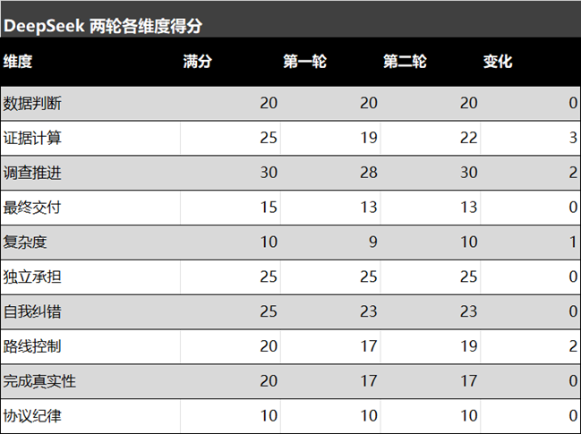

*表4  DeepSeek两轮现行 S 六维得分*

## 4.1 DeepSeek评分依据

数据基础与问题定义（/15） 13.25→14。检查分片、状态与观察窗口，第二轮进一步统一地址与ZIP口径。

证据与计算正确性（/20） 13.75→17.5。第一轮把住宅噪音错并进供暖与街道噪音；第二轮仍写错最大创建时间。

调查深度与判断（/20） 17.25→19.25。异常地址、邮编、关闭方式与固定30天观察互相对照。

人工复现与维护（/25） 19→20.5。保留23份CSV和检查记录，部分入口和说明仍需整理。

成品实际可用性（/10） 5.25→6.75。调查结果有用；第二轮总览截字及终稿时间错误仍影响直接使用。

### 自主性与资源纪律

自主性与资源纪律由8升至9.25/10。第一轮同类数据框错误连续出现，第二轮这类返工减少。两轮总分分别为76.5和87.25：地址和观察窗口调查更充分了，终稿时间错误和总览显示问题仍在，因此成品得6.75/10，使用前需要修订。

第二轮留下了较深入的地址和观察窗口调查，估算费用较低。采用前仍要修正终稿时间和显示问题，并回查所引用的结果；第一轮的类别错配也说明，主要合计数需要逐项核对。DeepSeek的25项评分与原件位置见Excel“评分与用量”的S分项。

## 5 GLM

### 第一轮的工作

GLM逐个文件汇总总量、季节变化、道路异常、机构时长、地区和渠道。道路调查从Street Condition月度变化继续查到Pothole（坑洞）、Cave-in（路面塌陷）、DOT（交通局）受理、日期和五区分布，其他方向主要是汇总比较。它注意到近期请求的关闭观察时间较短，但对DOHMH（卫生与心理健康局）流程和新旧类别关系的解释仍缺支持材料。

### 第二轮的工作

第二轮检查字段、分布、负时长和季节性后，增加同比类型增量分解，继续调查住宅噪声、热点地址、供暖季和关闭时长。GLM修正月均值与关闭率所用的月份数，修改生成脚本，再复算聚合表、检查图表和月表。核查热点结果时发现，地址前缀筛选还纳入了其他街道和投诉类型，原文将其解释为两个地址的住宅噪声，范围对不上。这个专题仍需重新界定后计算。

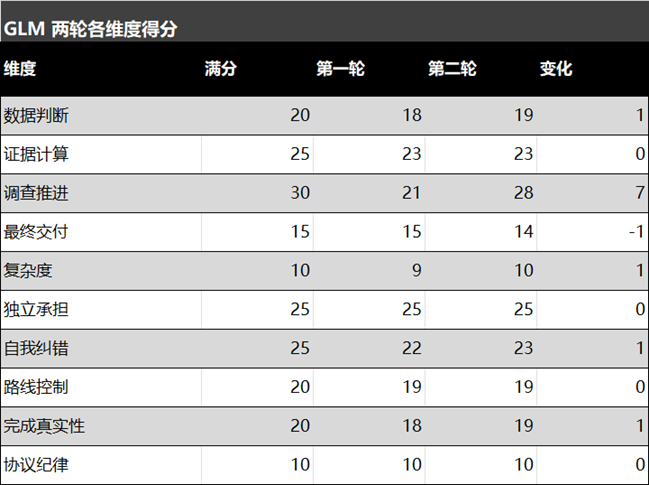

*表5  GLM两轮现行 S 六维得分*

## 5.1 GLM评分依据

数据基础与问题定义（/15） 12.25→13.25。覆盖全量数据并收至道路与热点问题；第二轮问题界定略有改善。

证据与计算正确性（/20） 15.25→16.25。547条Closed子集负时长统计正确；热点前缀的实际纳入范围未讲清。

调查深度与判断（/20） 12.5→17.75。第二轮补做类型增量、热点与观察窗口，调查分提高5.25。

人工复现与维护（/25） 18→17。专题增加后，聚合前置步骤未纳入完整复现入口，维护分下降。

成品实际可用性（/10） 6.75→7.5。交付速度快；热点定义和部分表头仍需改正。

### 自主性与资源纪律

自主性与资源纪律两轮均为9.25/10，第二轮约9.59分钟、目录价6.48元。这轮新增的调查使调查分从12.5升至17.75，但说明未完整交代聚合前置步骤，维护分由18降至17。复核还确认，547条Closed（已关闭）状态负时长的统计是正确的。

第二轮9.59分钟、目录价约6.48元，比GPT省时省费。若采用这份成果，需要先重新界定热点范围、重算相关结果，并补齐维护步骤；GLM的25项评分与原件位置见Excel“评分与用量”的S分项。

## 6 Qwen

### 第一轮的工作

Qwen比较总量、类别、地区和关闭时长，识别道路异常与分类变化，提交Excel和说明。第一轮对异常追查较少。回查Drug Activity（涉毒活动请求类别）的描述时，在相同11个月内，室内描述占比由约8%升至31%，与报告所写的“结构未变”不符。这里的结构指不同描述所占比例，需先修正这一判断，再解释该类请求的变化。

### 第二轮的工作

第二轮补查字段、唯一编号、缺失值、状态及时间异常，再拆解类别增量、行政区与渠道。Qwen追查噪声尖峰、地点分布和违停结构，也检查分类变化与Drug Activity。交付时多次修改标签和统计范围，读回文件并核对图表、说明及重算结果。评测时发现关闭时长仍用11个月与9个月比较；统一月份后，UNSANITARY（不卫生状况类别）增幅约12.6%，低于原文约18.2%。

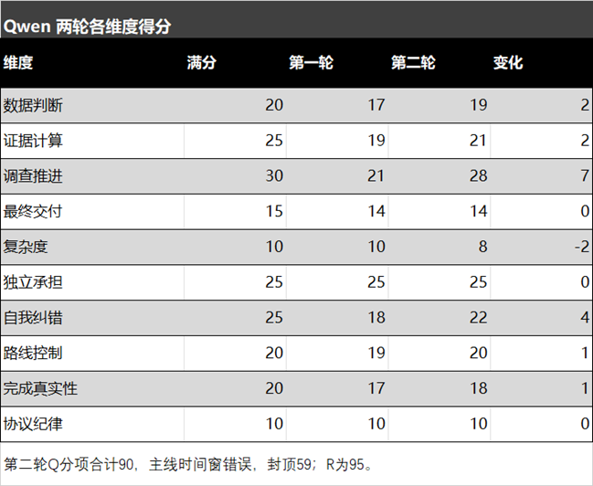

*表6  Qwen两轮现行 S 六维得分*

## 6.1 Qwen评分依据

数据基础与问题定义（/15） 10.25→14.25。第二轮补查唯一键、状态、缺失与时间异常，问题界定改善。

证据与计算正确性（/20） 15.25→12.75。第一轮称Drug Activity描述结构未变；第二轮关闭时长用了11个月对9个月。

调查深度与判断（/20） 8.75→14.75。第二轮扩至五项调查，增量与异常检查增加；主要时长比较仍须重做。

人工复现与维护（/25） 18→19。九张工作表和十五张图可查，重建与复现材料仍需统一口径。

成品实际可用性（/10） 6.75→6.75。正文、图表与比较时间窗未完全同步，两轮均为6.75。

### 自主性与资源纪律

自主性与资源纪律由8.5降至7.75/10。第二轮约60.21分钟、目录价14.33元，较多时间用于重建和检查文件。总分从67.5升至75.25，但前述时间窗口问题尚未解决，接手后要重做主要时长比较，并同步修改图表和正文。

第二轮耗时60.21分钟、目录价约14.33元，均高于GLM。两轮分别留下描述结构和时间窗口错误，主要比较还要重做。就这次个人使用而言，这次不再继续投入重试。Qwen的25项评分与原件位置见Excel“评分与用量”的S分项。

## 7 Gemini

### 第一轮的工作

Gemini第一轮调查异常地址、供暖分布、违停与噪声时段、机构处置时长，并提出治理建议。回查地址表时，缺失地址被合并成了一个高频地址；每万人口的请求数也被算成实际的十分之一。再读解释部分，报告把聚集请求当作真实事件、把空间差异归于阶层差异，并据结案描述评价部门效能。这些解释缺少进一步证据，现有统计不足以支持相应建议。

### 第二轮的工作

第二轮核对日期、字段和异常计数，再拆解部门与类别增量，调查道路、DEP（环境保护局）、供暖集中度、空间及处置结果。Gemini也检查近期未关闭记录、分类变化和生成文件。回查结案原句时，arrest（拘捕）命中95,943条，其中95,784条是否定表述，肯定仅159条。原文没有区分“未拘捕”等否定含义，用命中数量支持拘捕解释，结论需要重写。

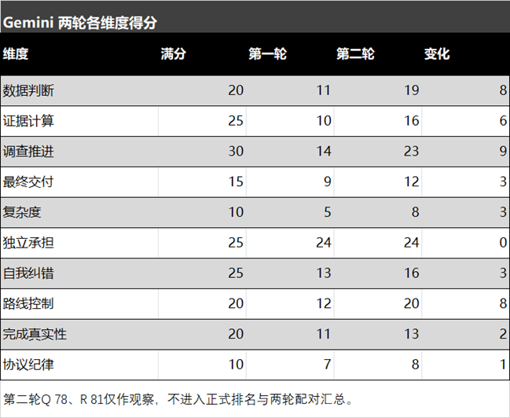

*表7  Gemini两轮现行 S 六维得分*

## 7.1 Gemini评分依据

数据基础与问题定义（/15） 5.75→10.5。第一轮把缺失地址合成高频地址，每万人口的请求数算成实际的十分之一；第二轮有所改善。

证据与计算正确性（/20） 6.5→10.5。第二轮arrest命中95943条，其中95784条是否定表述；肯定仅159条。

调查深度与判断（/20） 5.75→11.25。增长分解和集中度检查增多，但治理原因仍超出记录可支持范围。

人工复现与维护（/25） 10.75→14.25。维护入口有所改善，关键文本与口径仍需人工复核。

成品实际可用性（/10） 4.25→6。两轮都有工作簿，最终解释错误使成品不能直接用于决策。

### 自主性与资源纪律

自主性与资源纪律由6.5升至7/10。运行记录中仍有搜索项目根目录、暴露其他目录路径的行为。两轮总分为39.5和59.5；第二轮补充了增长分解和维护入口，但结案文本的误读仍影响主要解释，需在采用结果前处理。

两轮都有可回查的汇总结果，主要治理解释仍需重做。第二轮用时6.07分钟，但读回结案原句后发现的语义错误会改变相关结论，因此本次暂不采用其政策、人口或执法建议。Gemini的25项评分与原件位置见Excel“评分与用量”的S分项。

## 8 Claude

### 第一轮的调查与交付

Claude核对数据范围，调查高频地址、增长来源、类别、关闭时长、结案原句和重复记录，保存30张中间表、生成13个工作表。它按“同一地址、同一类别单日不少于200条”筛出4个住宅噪声组合，共185,791条，再比较剔除前后的趋势；用日均值处理365天与364天的差异，并检查已有足够时间观察关闭结果的请求批次（成熟队列）、机构时长及NYPD（警察局）结案描述。接管前留下15份脚本和34页预览。高频记录为何要全部剔除，仍缺充分依据。

Claude第一轮已完成主体调查、汇总、Excel和说明。Cursor额度用尽后，Grok订正说明中的数字、重建并检查成品；这段接续工作单列。Claude第二轮未运行。Claude阶段订阅额度内计价153.57元，含Grok接续共165.69元。

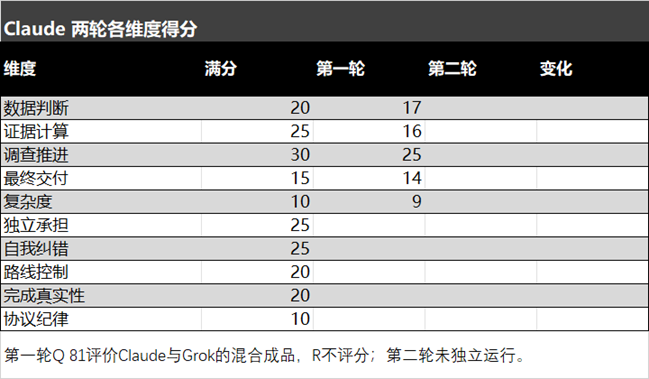

*表8  Claude第一轮现行 S 六维得分*

## 8.1 Claude评分依据

数据基础与问题定义（/15） 11.25。核查全量范围和高频地址，但将聚集记录直接视作无效样本欠妥。

证据与计算正确性（/20） 15.25。30张汇总表中28张可重做一致，另两张存在标签或口径差异。

调查深度与判断（/20） 15.75。调查增长、地址、成熟队列和结案文本，接管前形成主要分析。

人工复现与维护（/25） 18.25。15份正式脚本可追溯到Claude；末次订正与重建由Grok完成。

成品实际可用性（/10） 6。已有13表13图Excel及预览；关键筛选和交付一致性仍需核查。

### 自主性与资源纪律

自主性与资源纪律为5.5/10。Claude阶段订阅额度计价153.57元，后续由Grok接续，合计165.69元。按接管前材料核查，第一轮总分72：原脚本重做30张中间表，其中28张一致，另两张有标签或口径差异；高频记录剔除、集中出现的一组记录及天气解释还需补证据。最后的数字订正和重建由Grok完成。

## 9 Kimi

### 第一轮为何退出

Kimi第一轮多次提前结束，依赖人工催促，随后退出。现存记录不足以核出完整耗时、Token及费用；目录中也没有必交Excel和分析说明，状态按“退出”保留。

### 第二轮补充复测

第二轮先遇到启动器故障，当时模型尚未启动，另行登记。实际启动后，Kimi反复读取data_manifest.json输入文件清单；工具已提示文件未变化、重复读取没有收益，它仍未调整做法。评测方停止循环，未得到Excel或分析说明。

实际复测约2.65分钟，目录价估算1.48元。去掉计划、进度等管理动作后，共有14个处理任务的实质动作，其中13个被判为没有收益。Token指模型处理文字时使用的计量单位，不能直接当作字数；第一轮这类用量记录不完整。

### 评分处理

两轮均缺少完整成品，不具备25项逐项评分所需的分析和交付材料；S留空，不把失败填为0分。

第一轮退出、第二轮重复读取后停止，都是本次尝试的实际结果。因此，比较表中保留这两轮状态及已记录的资源使用，评分位置留空。

在本次Claude Code组合和两轮机会内，Kimi未交付可用成果；收到重复读取提示后，也未调整做法。就这次个人使用而言，已有时间、费用和催促记录不足以支持继续付费重试。

## 10 成果质量与可维护性比较

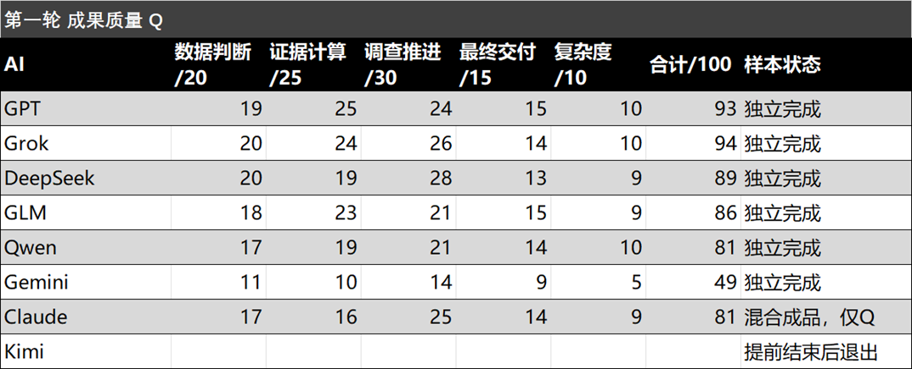

*表9  第一轮现行 S 六维得分*

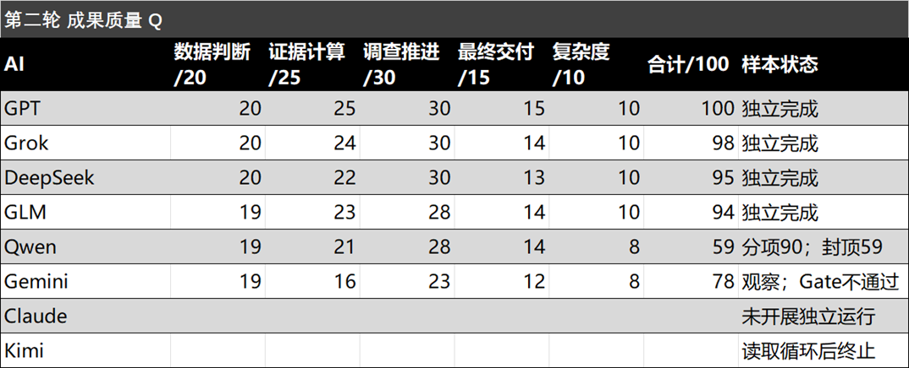

*表10  第二轮现行 S 六维得分*

## 10.1 六维差异与同分异因

先看数据范围和字段理解。GPT第二轮的数据基础A为15/15，DeepSeek与Qwen分别为14和14.25，Grok为13，Gemini由5.75升至10.5。检查范围较完整的成品也可能误解字段：Grok把BBL地块写成建筑，Gemini第一轮把缺失地址合并为一个地址，相应问题都计入这一维度。

沿着这些定义继续核对计算，Qwen第二轮的时长比较用了11个月对9个月，Gemini把arrest否定表述算入肯定解释，DeepSeek第一轮则混入了错误类别。这些问题直接影响结论。证据计算B中，GPT两轮均20/20；第二轮Grok19、DeepSeek17.5、GLM16.25、Qwen12.75、Gemini10.5。

再看系统是否沿着异常继续查。六系统调查判断C的均值由12.38升至17.04，增加4.67分，约占总增量49.3%。GPT第二轮排除峰日、固定构成，得到20/20；Grok与DeepSeek进一步查地块和地址，均为19.25。GLM增加了热点调查，但筛选范围有混入，还需回到原始记录核对。

接着尝试按提交说明重做和更新结果。GPT第二轮人工维护D为23.5/25，DeepSeek20.5、Qwen19、GLM与Grok各17、Gemini14.25。差异主要出在具体步骤：Grok一处文件检查始终通过，GLM漏写新增专题的聚合前置步骤，Qwen则需要先修正时间窗口再重做结果。

最后检查文件能否阅读，以及运行和接手过程还留下哪些问题。GPT第二轮成品E与自主性F均为10；DeepSeek虽做了较深调查，终稿时间错误和总览截字使E为6.75。Grok的E为7.75。Gemini的E与F分别为6和7，仍需修正结案解释并处理运行中的目录访问问题。

Grok85.25与DeepSeek87.25相差2分，前者主要缺维护说明和有效检查，后者还要订正终稿时间与显示。GLM81与Qwen75.25也各有问题：GLM需重定热点范围，Qwen需重做关键时长比较。

## 11 人工维护与自主性比较

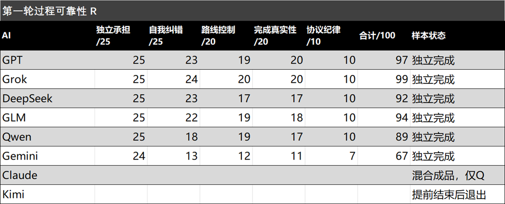

*表11  第一轮人工维护、成品与自主性*

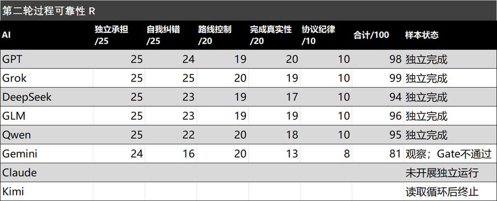

*表12  第二轮人工维护、成品与自主性*

人工维护的差别出现在交接时：GPT留下输入、SQL、结果和更新顺序，第二轮D为23.5；Grok两轮均17，脚本中一处文件存在检查始终通过且缺维护说明；GLM第二轮新增热点专题后D从18降到17，聚合前置步骤没有完整交代。

Claude接管前D为18.25，原脚本重做28/30张中间表一致，剩余两表存在标签或口径差异。Grok接续的数字订正与重建不能记作Claude自行修好。Kimi两轮没有成品，维度留空，但人工催促和读取循环属于明确的使用负担。

第二轮六系统运行期间均没有追加指令，交付后却仍登记了10项修正。自主性F中，GPT为10，Grok、DeepSeek、GLM均为9.25，Qwen7.75，Gemini7。这里的分数连同修正记录一起阅读，才能看清运行中需要多少介入，以及收到文件后还要做什么。

## 12 两轮变化

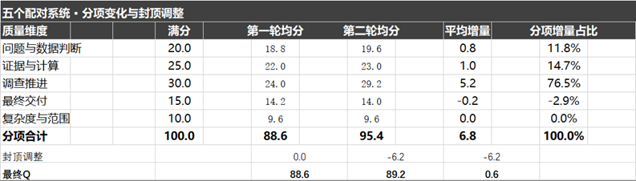

*表13  六系统现行 S 六维平均变化*

将同样六个系统的两轮结果放在一起，S均值由71.67升至81.13，增加9.46分。各自变化为GPT+10.5、Grok+0.75、DeepSeek+10.75、GLM+7、Qwen+7.75、Gemini+20。Gemini增加最多，第二轮仍为59.5分，前文发现的文本解释问题尚未解决，后续还需结合分项查看。

拆开总分后，六维平均增量为A+1.58、B+1.04、C+4.67、D+1.46、E+0.54、F+0.17。调查判断C约占一半，维护D和成品E的变化较小。结合各系统的提交材料，可以看到第二轮普遍增加了异常追查和对照计算，维护说明与终稿检查补充得较少。

Qwen第二轮增加五项调查与图表，S从67.5升至75.25，主要时长比较仍用了不同月份。GLM增加热点专题后，C由12.5升至17.75，但未补齐聚合前置说明，D由18降至17。这两份提交都增加了调查内容，同时留下了需要接手处理的具体问题。

GPT第二轮围绕峰日和固定构成补查，调查判断得20分，人工维护23.5分，成品与自主性均为满分。结合原运行中的成品检查和核心结论核查，只有这一轮满足第1.2节列出的全部参照条件。

### 12.1 评分变化与实际动作

逐项回看，GPT补了峰日排除与固定构成，Grok剔除固定Top10地块，DeepSeek加入地址与30天观察窗，GLM增加增量和热点分析，Qwen扩展调查，Gemini增加贡献分解。调查分记录这些工作的完成程度；计算错误及成品中的解释问题，继续记在证据计算B和成品E的对应细项中。

## 13 耗时、费用与后续修正

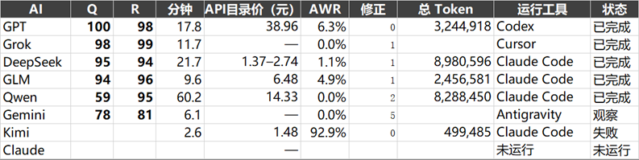

*表14  第二轮交付与资源指标*

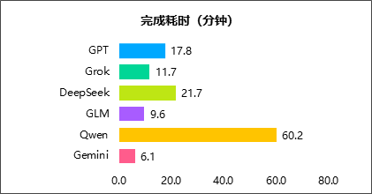

*图1  第二轮原生耗时*

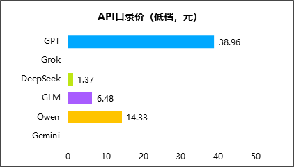

*图2  第二轮费用参考值*

第二轮费用参考值：GLM目录价6.48元，GPT38.96元，DeepSeek按忙时、闲时单价列为1.37—2.74元，Qwen14.33元；均按记录用量与公开单价估算。Grok的9.86元是Cursor订阅额度消耗。Gemini的5.12元则把Token用量按相应API单价折算，称为Token等价费用；API指软件调用模型的接口。上述金额计价方式不同，均不直接等于本次现金扣款。

耗时从各轮运行记录取得：GLM9.59分钟、GPT17.78、Grok11.71、DeepSeek21.70、Qwen60.21、Gemini6.07。GLM的热点定义、DeepSeek的终稿时间仍需修正；这些接手工作没有计入模型运行耗时。

## 13.1 无收益动作与后续修正

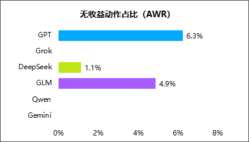

*图3  第二轮无收益动作占比*

图中AWR是无收益动作占比：确认无收益的动作数，除以实质动作数。实质动作包括直接推进交付、必要探索和确认无收益三类，计划或进度管理动作不计入分母；必要探索即使未进入终稿也不直接算浪费。六系统第二轮共300个实质动作，5个确认无收益。Qwen与Gemini这一比例均为0，成品仍有2项和5项修正。

六系统第二轮运行期间均无追加指令。交后修正共10项，涉及类别和对象定义、比较窗口、数字转述、文本语义及原因解释。GPT为0；Grok、DeepSeek、GLM各1；Qwen2；Gemini5。

这些修正的工作量也不同。GLM的字段数可以局部订正，热点定义则影响专题取数；Gemini要按否定语境重查结案文本，Qwen要统一时间窗口后重做比较。项目没有记录逐动作耗时和实际人工修正分钟，因此这里只列需要做的工作，不将任务数换算为人工工时。

个人选择时，除表中的时间与费用，还需要判断自己能否处理相应问题。例如，采用Qwen的时长结论前，要先完成窗口统一和重算；这部分投入尚未计入运行价格。

## 14 研究结论

回到开头的问题：这次给出相同数据、最多运行两轮后，六系统留下了两轮可评分成果，第二轮平均81.13分；Claude第一轮由Grok接续，Kimi两轮未形成成品。按前述检查和参照条件，GPT第二轮达到要求。结论限于本次任务与运行条件。

### 14.1 独立交付与接管

GPT第二轮已完成可供人接手的分析链，且未登记交后修正。Grok、DeepSeek、GLM在无追加指令下完成成品，但交接或终稿仍需局部补查。Claude第一轮主体工作已有价值，后段接管是实际使用成本；Kimi在两轮内没有完成。

### 14.2 成果差距在哪里

前文逐项核查后，GPT第二轮证据计算为20/20、调查20/20、维护23.5/25，主要结果可回查，也留下了对照计算和更新顺序。Grok与DeepSeek的调查同样有内容，但地块定义、维护检查、终稿时间或显示仍需补正。Qwen的时间窗口和Gemini的文本语义则影响主要结论，采用前需要重做相应部分。

### 14.3 第二轮改善了什么

两轮之间，六系统平均增加9.46分，其中调查深度增加4.67分，维护增加1.46分、成品增加0.54分。从已有文件能看到调查更深入了，交接和终稿问题仍较集中。由于第二轮提示、自身调整及运行环境可能共同影响结果，而且各条件仅运行一次，本次无法分离方法提示带来的具体贡献。

## 14.4 各系统综合评价

GPT　第二轮补查了峰日和渠道构成，主要文件与结果也经过检查。如果这次任务优先考虑完整交付和较少返工，可优先选用。两轮目录价约63.91元，高于Grok、DeepSeek、GLM、Qwen、Gemini的费用参考值，低于Claude含接续的165.69元。

Grok　供暖集中度等调查可供参考，接手后要补维护说明、有效检查和部分表述。第二轮11.71分钟，比GPT快；订阅内用量计价约9.86元，两轮合计16.34元。

DeepSeek　第二轮留下了较深入的地址和观察窗口调查，估算费用较低。采用前仍要修正终稿时间和显示问题，并回查所引用的结果；第一轮的类别错配也说明，主要合计数需要逐项核对。

GLM　第二轮9.59分钟、目录价约6.48元，比GPT省时省费。若采用这份成果，需要先重新界定热点范围、重算相关结果，并补齐维护步骤；

Qwen　第二轮耗时60.21分钟、目录价约14.33元，均高于GLM。两轮分别留下描述结构和时间窗口错误，主要比较还要重做。就这次个人使用而言，这次不再继续投入重试。

Gemini　两轮都有可回查的汇总结果，主要治理解释仍需重做。第二轮用时6.07分钟，但读回结案原句后发现的语义错误会改变相关结论，因此本次暂不采用其政策、人口或执法建议。

Claude　接管前已完成较多调查和大部分交付，高频记录剔除及部分解释仍缺依据。Claude阶段订阅额度计价153.57元，连同Grok接续共165.69元。在本次任务中，费用和接续工作都较多，个人使用暂不优先选用。

Kimi　两轮未获得可用交付，且已有时间、费用和人工催促记录。在本次工具组合下，暂不追加付费重试。

## 附录 评分明细与资料说明

本报告使用v2.2评分标准，对已保存的参赛成果逐项复核。“现行S”指本次使用的自主交付总分，旧版评分另存。共325条评分依据在Excel“评分与用量”的S分项中，得分批注附实际工作、缺口和原件位置，K列编号可到“查证.html”查询。编号由组别和序号组成，如D5就是D组第5项。

表中“14→15”依次表示第一轮14分、第二轮15分，“/15”表示该组满分15分；变化等于第二轮减第一轮。六系统配对均值只对两轮都有评分的同样六个系统求平均。Claude第二轮及Kimi两轮留空，空白不参与平均，也不按0分处理。Excel“评分细项”用AI下拉查看，“分维度比较”可选轮次、得分或得分率；得分率是得分除以该项满分。

A组看数据和选题：A1是否理解一条记录、字段和单位；A2是否处理会影响结论的数据问题；A3问题能否由已有数据回答；A4是否有理由优先调查这些问题。

B组看结果是否成立：B1数字、筛选及分子分母是否正确；B2比较的时间和对象是否可比；B3能否从结论找到输入、计算和结果；B4解释是否符合字段和原始记录。

C组看调查怎样继续：C1把总体差异拆到具体来源；C2沿异常查到日期、类别、地点或记录；C3改变筛选或加入对照后检查结论是否仍成立，并检查其他解释；C4发现矛盾后核查并同步修改；C5适时停止证据不足的方向，保留尚未解决的问题。

D组看接手所需材料：D1能否找到阅读入口与执行步骤；D2能否理解处理和计算中的选择；D3能否按现有材料重做主要结果；D4能否更新数据、定位错误并核对受影响内容；D5原AI是否检查过最终成品。

E组看最终文件：E1能否找到答案并完成比较；E2文字、图表和筛选是否显示正常；E3各文件是否一致，声称完成的工作是否实际留下。F组看运行与负担：F1是否需要指导或接管；F2交付后还需修正哪些问题；F3遇到失败能否调整做法；F4是否复用已有结果、减少无效计算并清理自建应用。

原始参赛作品保留在各系统目录，输入清单在input/data_manifest.json。人维护的代表任务由AI辅助审读和执行；本项目未观察真人实际操作。

本评测仅由一名评审给分，没有测量评审间一致性，也没有记录人工监督或修正工时。

## 附表1 GPT评分细项

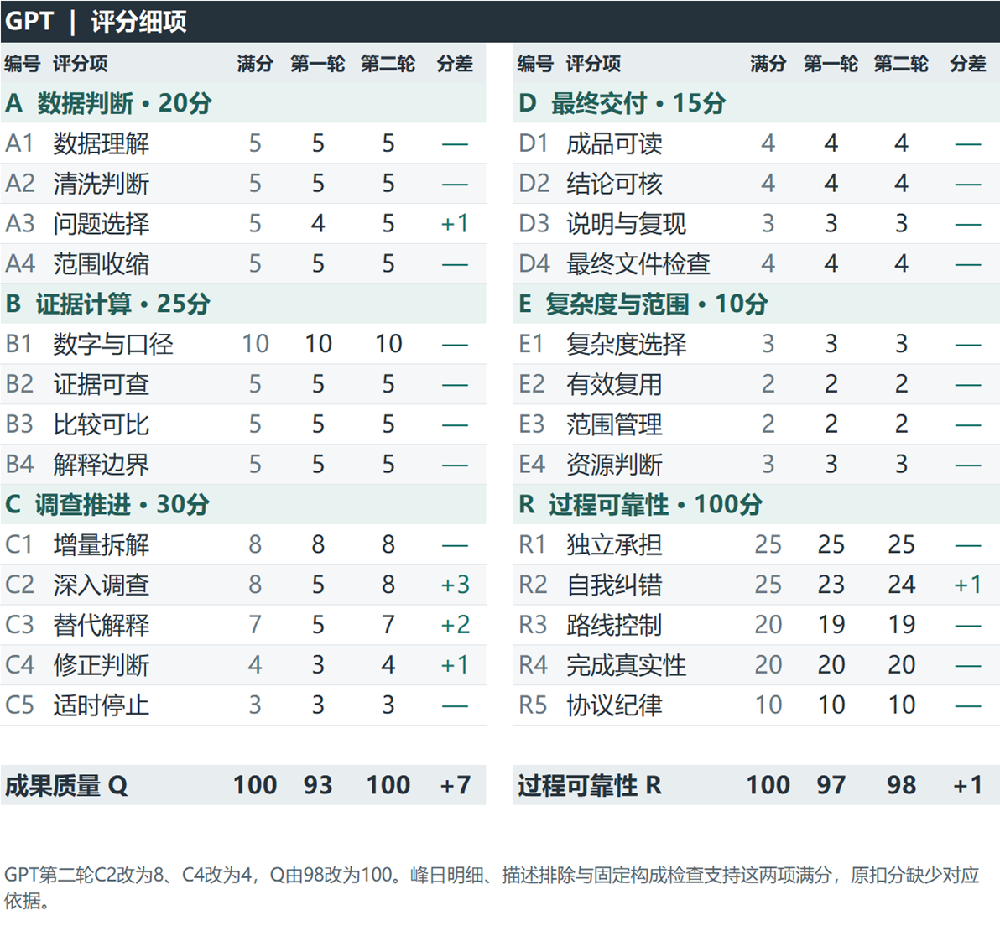

*表15  GPT现行 S 25项得分*

## 附表2 Grok评分细项

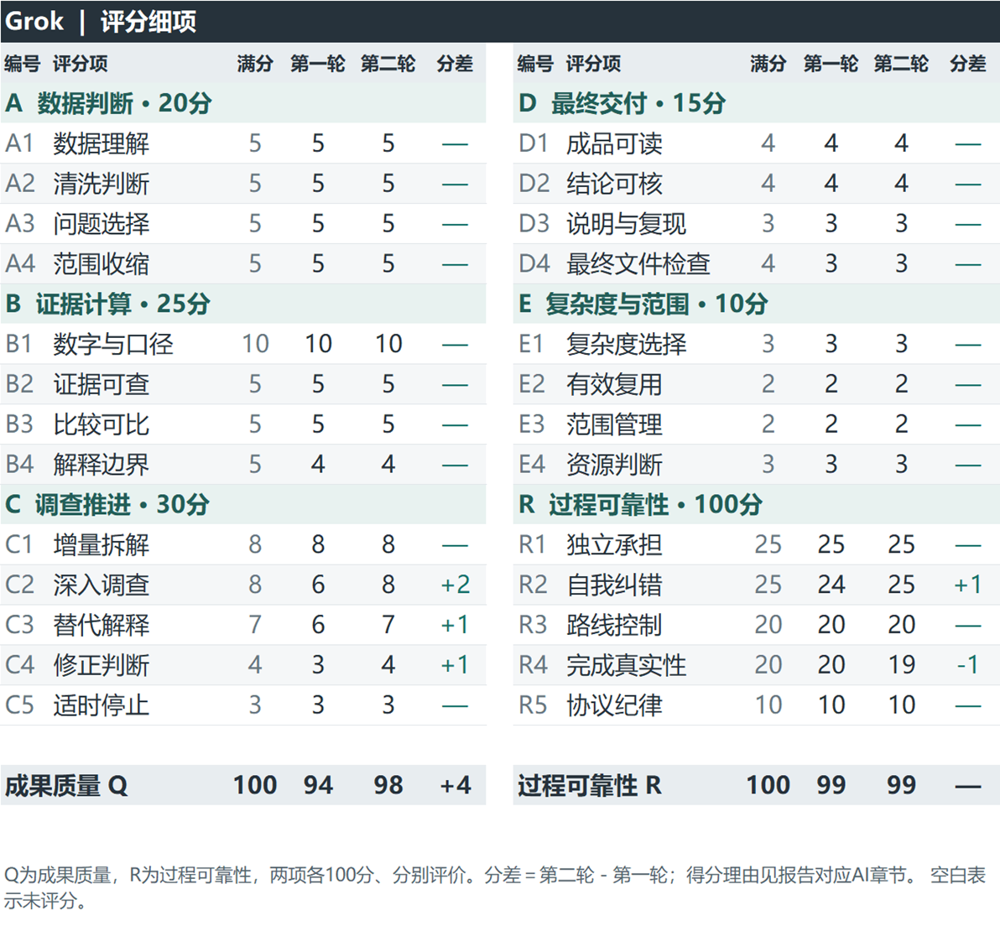

*表16  Grok现行 S 25项得分*

## 附表3 DeepSeek评分细项

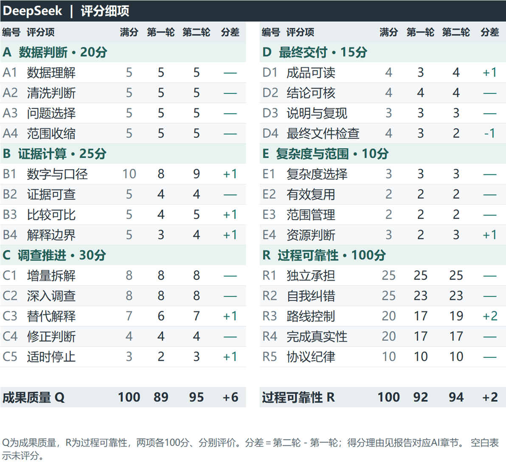

*表17  DeepSeek现行 S 25项得分*

## 附表4 GLM评分细项

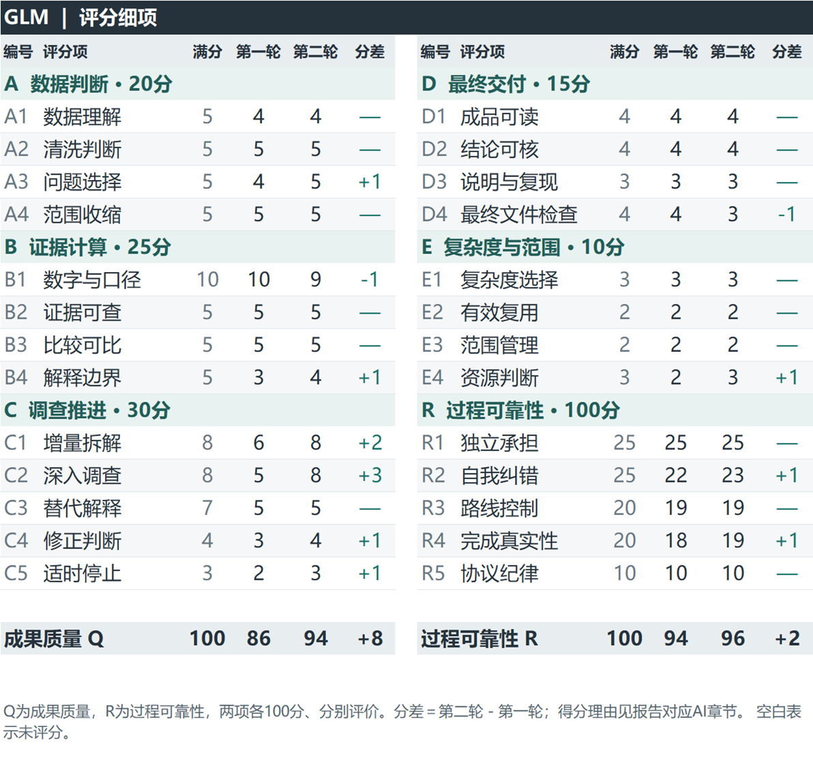

*表18  GLM现行 S 25项得分*

## 附表5 Qwen评分细项

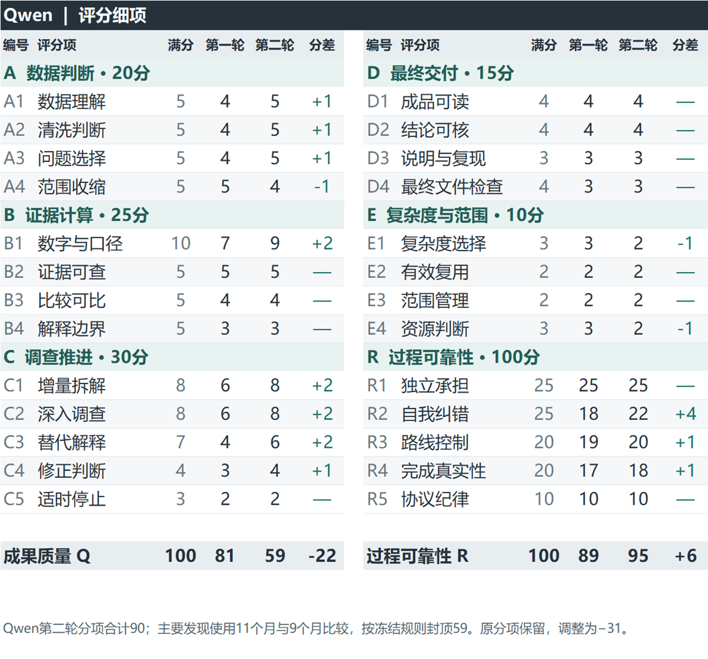

*表19  Qwen现行 S 25项得分*

## 附表6 Gemini评分细项

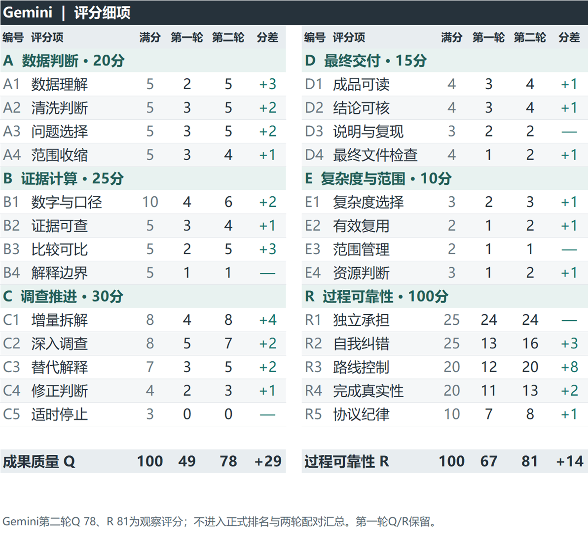

*表20  Gemini现行 S 25项得分*

## 附表7 Claude评分细项

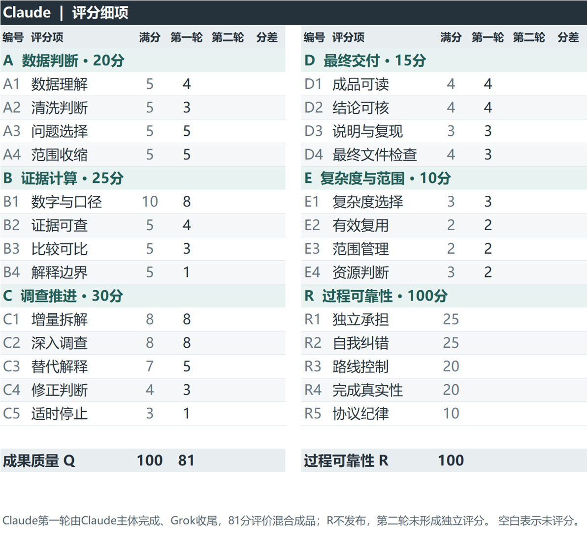

*表21  Claude现行 S 25项得分*
